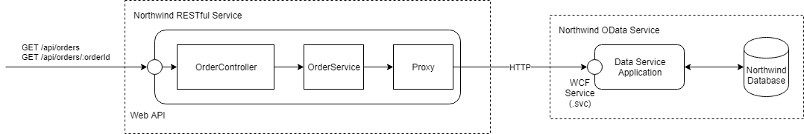

# Northwind Data Services

## Задача 2 - Northwind Web App

Цели:
* Научиться создавать веб-приложения, используя ASP.NET Core.
* Научиться создавать версионированный Web API.
* Научиться создавать Swagger-документацию для Web API.
* Научиться конфигурировать приложения ASP.NET Core.
* Научиться журналировать работу приложения через встроенный логгер ASP.NET Core и Serilog.
* Научиться автоматически трансформировать сущности в DTO с помощью AutoMapper.
* Научиться использовать инструменты для автоматического анализа кода (StyleCop, FxCop analysers) и автоматической настройки IDE (.editorconfig).

Схема приложения:



### Требуемые программы

* [.NET Core](https://dotnet.microsoft.com/download).
* [Visual Studio Code](https://code.visualstudio.com/). Допустимо использовать [Visual Studio 2019](https://visualstudio.microsoft.com/downloads/) при сохранении подхода, описанного в данном руководстве. 
* [Git](https://git-scm.com/downloads)

Данное руководство создавалось для версии .NET Core 3, которая на текущий момент находится в preview, поэтому возможны расхождения с кодом для версии .NET Core 2 и финальной версией .NET Core 3.

```sh
$ dotnet --list-sdks
3.0.100-preview7-012821 [C:\Program Files\dotnet\sdk]
```

Рабочая версия приложения для версии .NET Core 3 находится в каталоге [northwind-basic-app-final-3](./northwind-basic-app-final-3). Код этого приложения может быть использован в случае возникновения проблем при использовании этого руководства.


### Шаг 1. Создание базового приложения ASP.NET Core

#### Материалы для изучения

* [Create web APIs with ASP.NET Core](https://docs.microsoft.com/en-us/aspnet/core/web-api/?view=aspnetcore-2.2)
* [Tutorial: Create a web API with ASP.NET Core](https://docs.microsoft.com/en-us/aspnet/core/tutorials/first-web-api?view=aspnetcore-2.2&tabs=visual-studio)
* Metanit: [Глава 2. Основы ASP.NET Core](https://metanit.com/sharp/aspnet5/2.13.php)
* [Учусь .NET Core](https://riptutorial.com/Download/dot-net-core-ru.pdf)

#### Выполнение

1. [Создайте](https://github.com/new) новый *private* репозиторий _northwind-basic-app_ и клонируйте его на локальный диск. При создании укажите настройку .gitignore - _VisualStudio_.

2. Создайте в клонированном репозитории новую ветку _step1-create-basic-app_ и переключитесь на нее.

```sh
$ git checkout -b step1-create-basic-app
```

3. Создайте в каталоге клонированного репозитория новое приложение типа web с именем NorthwindWebApiApp.

```sh
$ dotnet new web -n NorthwindWebApiApp
$ dotnet new sln -n NorthwindBasicApp
$ dotnet sln NorthwindBasicApp.sln add NorthwindWebApiApp\NorthwindWebApiApp.csproj
```

4. Соберите проект, добавьте файлы в stage, сделайте commit и опубликуйте изменения в удаленную ветку.

```sh
$ dotnet build
$ git status
$ git add *.cs *.csproj *.sln *.json
$ git commit -m "Create basic app."
$ git push --set-upstream origin step1-create-basic-app
```

5. Переключитесь на ветку master и сделайте [no fast-forward merge](http://zencoder.ru/git/fast-forward-git/) изменений из ветки _step1-create-basic-app_. После этого опубликуйте изменения в удаленную ветку master.

```sh
$ git checkout master
$ git merge step1-create-basic-app --no-ff
$ git log --oneline
$ git push
```


### Шаг 2. Настройка проекта

#### Материалы для изучения

* [.NET Core, Code Analysis and StyleCop](https://carlos.mendible.com/2017/08/24/net-core-code-analysis-and-stylecop)
* [Automated, portable code style checking in .NET Core projects](https://blog.markvincze.com/automated-portable-code-style-checking-in-net-core-projects/)
* [Configuring StyleCop Analyzers](https://github.com/DotNetAnalyzers/StyleCopAnalyzers/blob/master/documentation/Configuration.md)
* [Overview of code analysis for managed code in Visual Studio](https://docs.microsoft.com/en-us/visualstudio/code-quality/code-analysis-for-managed-code-overview)
* [Create portable, custom editor settings with EditorConfig](https://docs.microsoft.com/en-us/visualstudio/ide/create-portable-custom-editor-options)
* [.NET coding convention settings for EditorConfig](https://docs.microsoft.com/en-us/visualstudio/ide/editorconfig-code-style-settings-reference)

#### Выполнение

1. Создайте новую ветку _step2-configure-project_ и переключитесь на нее.

```sh
$ git checkout -b step2-configure-project
```

2. Добавьте пакеты для анализа кода - Microsoft.CodeAnalysis.FxCopAnalyzers и StyleCop.Analyzers.

```sh
$ dotnet add NorthwindWebApiApp\NorthwindWebApiApp.csproj package Microsoft.CodeAnalysis.FxCopAnalyzers
$ dotnet add NorthwindWebApiApp\NorthwindWebApiApp.csproj package StyleCop.Analyzers
```

3. Скопируйте файл [code-analysis.ruleset](northwind-basic-app/NorthwindWebApiApp/code-analysis.ruleset) в каталог проекта.

4. Добавьте файл правил code-analysis.ruleset и другие настройки в файл проекта [NorthwindWebApiApp.csproj](northwind-basic-app/NorthwindWebApiApp/NorthwindWebApiApp.csproj).

```xml
<PropertyGroup>
  <CodeAnalysisRuleSet>code-analysis.ruleset</CodeAnalysisRuleSet>
  <DocumentationFile>$(OutputPath)$(AssemblyName).xml</DocumentationFile>
  <NoWarn>$(NoWarn),1573,1591,1712</NoWarn>
</PropertyGroup>
```

5. Скопируйте файл [stylecop.json](northwind-basic-app/NorthwindWebApiApp/stylecop.json) в каталог проекта.

6. Добавьте файл правил stylecop.json в файл проекта [NorthwindWebApiApp.csproj](northwind-basic-app/NorthwindWebApiApp/NorthwindWebApiApp.csproj).

```xml
<ItemGroup>
  <AdditionalFiles Include="stylecop.json" />
</ItemGroup>
```

7. Соберите проект.

```sh
$ dotnet build                                                                                                     Microsoft (R) Build Engine version 16.3.0-preview-19329-01+d31fdbf01 for .NET Core
Copyright (C) Microsoft Corporation. All rights reserved.

  Restore completed in 30.55 ms for D:\northwind-basic-app\NorthwindWebApiApp\NorthwindWebApiApp.csproj.
  You are using a preview version of .NET Core. See: https://aka.ms/dotnet-core-preview
Program.cs(12,18): error CA1052: Type 'Program' is a static holder type but is neither static nor NotInheritable [D:\northwind-basic-app\NorthwindWebApiApp\NorthwindWebApiApp.csproj]
Program.cs(1,1): warning SA1412: Store files as UTF-8 with byte order mark [D:\northwind-basic-app\NorthwindWebApiApp\NorthwindWebApiApp.csproj]
Startup.cs(1,1): warning SA1412: Store files as UTF-8 with byte order mark [D:\northwind-basic-app\NorthwindWebApiApp\NorthwindWebApiApp.csproj]
Startup.cs(17,21): warning CA1822: Member ConfigureServices does not access instance data and can be marked as static (Shared in VisualBasic) [D:\northwind-basic-app\NorthwindWebApiApp\North
windWebApiApp.csproj]
Startup.cs(22,21): warning CA1822: Member Configure does not access instance data and can be marked as static (Shared in VisualBasic) [D:\northwind-basic-app\NorthwindWebApiApp\NorthwindWebA
piApp.csproj]
Startup.cs(35,27): warning CA2007: Consider calling ConfigureAwait on the awaited task [D:\northwind-basic-app\NorthwindWebApiApp\NorthwindWebApiApp.csproj]

Build FAILED.

Program.cs(1,1): warning SA1412: Store files as UTF-8 with byte order mark [D:\northwind-basic-app\NorthwindWebApiApp\NorthwindWebApiApp.csproj]
Startup.cs(1,1): warning SA1412: Store files as UTF-8 with byte order mark [D:\northwind-basic-app\NorthwindWebApiApp\NorthwindWebApiApp.csproj]
Startup.cs(17,21): warning CA1822: Member ConfigureServices does not access instance data and can be marked as static (Shared in VisualBasic) [D:\northwind-basic-app\NorthwindWebApiApp\North
windWebApiApp.csproj]
Startup.cs(22,21): warning CA1822: Member Configure does not access instance data and can be marked as static (Shared in VisualBasic) [D:\northwind-basic-app\NorthwindWebApiApp\NorthwindWebA
piApp.csproj]
Startup.cs(35,27): warning CA2007: Consider calling ConfigureAwait on the awaited task [D:\northwind-basic-app\NorthwindWebApiApp\NorthwindWebApiApp.csproj]
Program.cs(12,18): error CA1052: Type 'Program' is a static holder type but is neither static nor NotInheritable [D:\northwind-basic-app\NorthwindWebApiApp\NorthwindWebApiApp.csproj]
    5 Warning(s)
    1 Error(s)

Time Elapsed 00:00:02.65
```

8. Исправьте ошибки и предупреждения компилятора - [CA1052](https://docs.microsoft.com/en-us/visualstudio/code-quality/ca1052-static-holder-types-should-be-sealed?view=vs-2019), [SA1412](https://github.com/DotNetAnalyzers/StyleCopAnalyzers/blob/master/documentation/SA1412.md). Предупреждение [CA1822](https://docs.microsoft.com/en-us/visualstudio/code-quality/ca1822-mark-members-as-static?view=vs-2019) не может быть исправлено, но предупреждение можно отключить в коде:

```cs
#pragma warning disable CA1822
public void ConfigureServices(IServiceCollection services)
{
}

public void Configure(IApplicationBuilder app, IWebHostEnvironment env)
{
}
#pragma warning restore CA1822
```

9. Добавьте файлы в stage, сделайте commit.

```sh
$ git status
$ git add *.csproj *.cs *.xml *.json *.ruleset
$ git commit -m "Configure project."
```

10. Создайте файл .editorconfig в каталоге проекта и добавьте в него пример из [Example EditorConfig file](https://docs.microsoft.com/en-us/visualstudio/ide/editorconfig-code-style-settings-reference). Для Visual Studio Code установите extension [EditorConfig for VS Code](https://marketplace.visualstudio.com/items?itemName=EditorConfig.EditorConfig)

11. Добавьте файл в stage, сделайте commit и опубликуйте изменения в удаленную ветку.

```sh
$ git status
$ git add *.editorconfig
$ git commit -m "Add .editorconfig."
$ git push --set-upstream origin step2-configure-project
```

12. Переключитесь на ветку master и сделайте no fast-forward merge, опубликуйте изменения.

```sh
$ git checkout master
$ git merge step2-configure-project --no-ff
$ git push
```


### Шаг 3. Добавление сервиса

#### Материалы для изучения

* [How to: Add Query Options to a Data Service Query (WCF Data Services)](https://docs.microsoft.com/en-us/dotnet/framework/data/wcf/how-to-add-query-options-to-a-data-service-query-wcf-data-services)
* Metanit: [Глава 7. Контроллеры](https://metanit.com/sharp/aspnet5/5.1.php)
* Metanit: [Глава 11. Модели](https://metanit.com/sharp/aspnet5/8.1.php)

#### Выполнение

1. Создайте новую ветку _step3-add-service_ и переключитесь на нее.

```sh
$ git checkout -b step3-add-service
```

2. Добавьте пакет [Microsoft.Data.Services.Client](https://www.nuget.org/packages/Microsoft.Data.Services.Client), чтобы добавить в приложение возможность работать с сервисами OData.

```sh
$ dotnet add NorthwindWebApiApp\NorthwindWebApiApp.csproj package Microsoft.Data.Services.Client
```

3. Поместите [NorthwindDataService.cs](northwind-basic-app/NorthwindWebApiApp/ExternalServices/NorthwindDataService.cs) (описание сервиса, которое сгенерировала утилита DataSvcUtil.exe, версия 3) в папку NorthwindWebApiApp\ExternalServices.

4. Добавьте модели [BriefOrderModel.cs](northwind-basic-app/NorthwindWebApiApp/Models/BriefOrderModel.cs) и [FullOrderModel.cs](northwind-basic-app/NorthwindWebApiApp/Models/FullOrderModel.cs) в папку NorthwindWebApiApp\Models.

5. Добавьте интерфейс и реализацию сервиса [IOrderService.cs](northwind-basic-app/NorthwindWebApiApp/Services/IOrderService.cs) и [OrderService.cs](northwind-basic-app/NorthwindWebApiApp/Services/OrderService.cs) в папку NorthwindWebApiApp\Services.

6. Добавьте новый контроллер [OrdersController](northwind-basic-app/NorthwindWebApiApp/Controllers/OrdersController.cs) в папку NorthwindWebApiApp\Controllers. В контроллере определены следующие actions:

* GetOrders - возвращает список всех заказов в кратком формате.
* GetOrder(int orderId) - возвращает подробную информацию о заказе с указанным orderId в полном формате.

Список endpoins, глаголов и статусов контроллера в таблице:

| Endpoint             | Http Verb | Status Codes                        |
| -------------------- | --------- | ----------------------------------- |
| /api/orders          | GET       | 200 (success), 500 (internal error) |
| /api/orders/:orderId | GET       | 200 (success), 500 (internal error) |

7. Зарегистрируйте сервис в Startup.cs - см. код в [Startup.cs](northwind-basic-app/NorthwindWebApiApp/Startup.cs). Добавьте необходимый конфигурационный код в методы ConfigureServices и Configure, чтобы подключить контроллер. 

8. Запустите и проверьте работоспособность приложения.

```sh
$ dotnet build
$ dotnet run --project NorthwindWebApiApp
```

9. Commit, merge.

```sh
$ git status
$ git add *.csproj *.cs *.xml
$ git commit -m "Add service NorthwindDataService, OrderService, OrdersController."
$ git push --set-upstream origin step3-add-service
$ git checkout master
$ git merge step3-add-service --no-ff
$ git push
```


### Шаг 4. Конфигурация сервиса через IOption<T>

#### Материалы для изучения

* [Configuration in ASP.NET Core](https://docs.microsoft.com/en-us/aspnet/core/fundamentals/configuration/)
* [Getting value from appsettings.json in .net core](https://stackoverflow.com/questions/46940710/getting-value-from-appsettings-json-in-net-core)
* Metanit: [Глава 3. Сервисы и Dependency Injection](https://metanit.com/sharp/aspnet5/6.1.php)
* Metanit: [Глава 4. Конфигурация](https://metanit.com/sharp/aspnet5/2.6.php)

#### Выполнение

1. Создайте новую ветку _step4-add-configuration_ и переключитесь на нее.

2. Добавьте в файл _appsettings.json_ новую секцию _NorthwindServiceConfiguration_.

```json
"NorthwindServiceConfiguration": {
  "Uri": "https://services.odata.org/V3/Northwind/Northwind.svc"
}
```

3. Добавьте новый класс NorthwindServiceConfiguration в каталог Configuration.

```cs
namespace NorthwindWebApiApp.Configuration
{
    public class NorthwindServiceConfiguration
    {
        public Uri Uri { get; set; }
    }
}
```

4. Добавьте код в класс Startup.

```cs
private IConfiguration configuration;

public Startup(IConfiguration configuration)
{
	this.configuration = configuration;
}

public void ConfigureServices(IServiceCollection services) {
	...
	services.Configure<Configuration.NorthwindServiceConfiguration>(this.configuration.GetSection("NorthwindServiceConfiguration"));
}
```

5. Добавьте в конструктор [OrderService](northwind-basic-app/NorthwindWebApiApp/Services/OrderService.cs) параметр northwindServiceConfiguration и используйте его, чтобы инициализировать объект NorthwindEntities значением _Uri_ из конфигурационного файла.

6. Запустите и проверьте работоспособность приложения.

7. Commit "Add configuration to appsettings.json.", merge.


### Шаг 5. Документирование сервиса

#### Материалы для изучения

* [ASP.NET Core web API help pages with Swagger / OpenAPI](https://docs.microsoft.com/en-us/aspnet/core/tutorials/web-api-help-pages-using-swagger)
* [Get started with Swashbuckle and ASP.NET Core](https://docs.microsoft.com/en-us/aspnet/core/tutorials/getting-started-with-swashbuckle)
* [What is Swagger, Swashbuckle and Swashbuckle UI](https://stackoverflow.com/questions/43441683/what-is-swagger-swashbuckle-and-swashbuckle-ui)

#### Выполнение

1. Создайте новую ветку _step5-add-swagger_ и переключитесь на нее.

2. Добавьте пакет [Swashbuckle.AspNetCore](https://www.nuget.org/packages/swashbuckle.aspnetcore/). Если используется версия .NET Core 2.0, то версию указывать не обязательно.

```sh
$ dotnet add NorthwindWebApiApp\NorthwindWebApiApp.csproj package Swashbuckle.AspNetCore
```

Если используется .NET Core 3.0, то укажите последнюю доступную RC версию пакета.

```sh
$ dotnet add NorthwindWebApiApp\NorthwindWebApiApp.csproj package Swashbuckle.AspNetCore --version 5.0.0-rc2
```

3. [Добавьте и сконфигурируйте Swagger middleware.](https://docs.microsoft.com/en-us/aspnet/core/tutorials/getting-started-with-swashbuckle?view=aspnetcore-2.2&tabs=visual-studio#add-and-configure-swagger-middleware)

4. [Включите генерацию документации](https://docs.microsoft.com/en-us/aspnet/core/tutorials/getting-started-with-swashbuckle?view=aspnetcore-2.2&tabs=visual-studio#xml-comments) в файле проекта _NorthwindWebApiApp.csproj_.

5. Включите поддержку [XML-документации в AddSwaggerGen](https://docs.microsoft.com/en-us/aspnet/core/tutorials/getting-started-with-swashbuckle?view=aspnetcore-2.2&tabs=visual-studio#xml-comments).

6. Запустите и проверьте работоспособность приложения через [Swagger UI](http://locahost:5000/). Если консоль не доступна, проверьте localhost:5000/swagger. Если консоль доступна по этому endpoint, значит RoutePrefix в UseSwaggerUI не сконфигурирован корректно.

7. Проверьте, что документация отображается корректно на Swagger UI.

8. Commit "Add SwaggerUI console.", merge.


### Шаг 6. Версионирование API

#### Материалы для изучения

* [ASP.NET API Versioning](https://github.com/microsoft/aspnet-api-versioning)
* [New Services Quick Start](https://github.com/microsoft/aspnet-api-versioning/wiki/New-Services-Quick-Start#aspnet-core)
* [ASP.NET Core Examples](https://github.com/microsoft/aspnet-api-versioning/tree/master/samples/aspnetcore)

#### Выполнение

1. Создайте новую ветку _step6-add-versioning_ и переключитесь на нее.

2. Добавьте пакет [Microsoft.AspNetCore.Mvc.Versioning](https://www.nuget.org/packages/Microsoft.AspNetCore.Mvc.Versioning/). Если используется версия .NET Core 2.0, то версию указывать не обязательно.

```sh
$ dotnet add NorthwindWebApiApp\NorthwindWebApiApp.csproj package Microsoft.AspNetCore.Mvc.Versioning
```

Если используется .NET Core 3.0 укажите последнюю доступную RC версию пакета.

```sh
$ dotnet add NorthwindWebApiApp\NorthwindWebApiApp.csproj package Microsoft.AspNetCore.Mvc.Versioning --version 4.0.0-preview8.19405.7
```

3. Добавьте поддержку версионирования в метод Startup.ConfigureServices.

```cs
services.AddApiVersioning(
    options =>
    {
        // reporting api versions will return the headers "api-supported-versions" and "api-deprecated-versions"
        options.ReportApiVersions = true;
    });
```

4. Установите версию 1.0 для контроллера OrdersController и добавьте поддержку версии в Uri.

```cs
[ApiController]
[ApiVersion("1.0")]
[Route("api/v{version:apiVersion}/[controller]")]
public class OrdersController : ControllerBase
```

5. Запустите и проверьте работоспособность приложения - [localhost/api/v1/orders](http://localhost:5000/api/v1/orders).

6. Commit "Add versioning for OrdersController."

7. Добавьте новую модель BriefOrderVersion2Model, которая должна расширять _BriefOrderModel_ двумя новыми полями - CustomerId и EmployeeId.

```cs
public class BriefOrderVersion2Model : BriefOrderModel
{
    public string CustomerId { get; set; }

    public int? EmployeeId { get; set; }
}
```

8. Расширьте интерфейс _IOrderService_ новым методом _GetExtendedOrdersAsync_, который должен возвращать список _BriefOrderVersion2Model_.

9. Добавьте в сервис _OrderService_ реализацию метода _GetExtendedOrdersAsync_ по образцу _GetOrdersAsync_. Новый метод должен возвращать список _BriefOrderVersion2Model_ с заполненными полями _CustomerId_ и _EmployeeId_.

10. Добавьте новый контроллер _OrdersVersion2Controller_, который должен в методе GetOrders возвращать список _BriefOrderVersion2Model_.

```cs
[ApiController]
[ApiVersion("2.0")]
[Route("api/v{version:apiVersion}/orders")]
public class OrdersVersion2Controller : ControllerBase
```

11. Запустите и проверьте работоспособность приложения - [localhost/api/v2/orders](http://localhost:5000/api/v2/orders).

12. Commit "Add OrdersVersion2Controller.", merge.


### Шаг 7. Журналирование работы приложения

#### Материалы для изучения

* [Logging in ASP.NET Core](https://docs.microsoft.com/en-us/aspnet/core/fundamentals/logging)
* Metanit: [Логгирование](https://metanit.com/sharp/aspnet5/2.10.php)
* [Logging in ASP .NET Core](https://wakeupandcode.com/logging-in-asp-net-core/)
* [Логирование как способ отлаживать код](https://habr.com/ru/post/354962/)
* [Структурное логирование на примере Serilog и Seq](https://habr.com/ru/post/266299/)
* [Документация serilog](https://serilog.net/)

#### Выполнение

1. Создайте новую ветку _step7-add-logging_ и переключитесь на нее.

2. Измените конфигурацию журналирования по-умолчанию в методе Program.CreateHostBuilder.

```cs
.ConfigureLogging(config =>
{
    config.ClearProviders();
    config.AddConsole();
    config.AddDebug();
});
``` 

3. Добавьте в конструкторы контроллеров _OrdersController_ и _OrdersVersion2Controller_ параметр ILogger<T>, сохраните логер в поле.

Пример кода:

```cs
public class OrdersController : ControllerBase
{
    private readonly ILogger<OrdersController> logger;

    public OrdersController(IOrderService orderService, ILogger<OrdersController> logger)
    {
        this.orderService = orderService ?? throw new ArgumentNullException(nameof(orderService));
        this.logger = logger ?? throw new ArgumentNullException(nameof(logger));
    }
```

4. Добавьте журналирование во все actions.

Пример кода:

```cs
public async Task<ActionResult<IEnumerable<BriefOrderModel>>> GetOrders()
{
    this.logger.LogInformation("Calling OrdersController.GetOrders");
    try
    {
        return this.Ok(await this.orderService.GetOrdersAsync());
    }
    catch (Exception e)
    {
        this.logger.LogError(e, "Exception in OrdersController.GetOrders.");
        throw;
    }
}
```

5. Соберите и запустите приложение. Проверьте, что при выполнении запроса в консоль попадает журналируемый текст.

6. Добавьте логер в конструктор _OrderService_ и добавьте в методы сервиса информацию о вызове удаленного сервиса.

Пример кода:

```cs
public async Task<IEnumerable<BriefOrderModel>> GetOrdersAsync()
{
    this.logger.LogDebug($"Getting data from ${this.uri.AbsoluteUri}.");
```

7. Соберите и запустите приложение. Проверьте, что при выполнении запроса в консоль попадает журналируемый текст.

8. Commit "Add logging for OrdersController, OrdersVersion2Controller and OrderService."

9. Добавьте пакет [Serilog.AspNetCore](https://www.nuget.org/packages/Serilog.AspNetCore/).

10. Добавьте поддержку Serilog в [методы Program.Main и Program.CreateHostBuilder](https://github.com/serilog/serilog-aspnetcore).

11. Удалите секцию _Logging_ из конфигурационных файлов _appsettings.json_ и _appsettings.Development.json_.

12. Соберите и запустите приложение. Проверьте, что вывод журнала в консоль изменился.

13. Commit "Add serilog.", merge.


### Шаг 8. Добавление Automapper

#### Материалы для изучения

* [AutoMapper Documentation](https://docs.automapper.org/en/stable/)
* [How to set up Automapper in ASP.NET Core](https://stackoverflow.com/questions/40275195/how-to-set-up-automapper-in-asp-net-core)

#### Выполнение

1. Создайте новую ветку _step8-add-automapper_ и переключитесь на нее.

2. Добавьте пакеты [AutoMapper](https://www.nuget.org/packages/AutoMapper/) и [AutoMapper.Extensions.Microsoft.DependencyInjection](https://www.nuget.org/packages/AutoMapper.Extensions.Microsoft.DependencyInjection/).

3. Добавьте новые классы в каталог Service - _BriefOrderDescription_, _BriefOrderVersion2Description_ и _FullOrderDescription_. Содержимое должно быть копией соответствующих моделей.

4. Измените классы _IOrderService_ и _OrderService_, чтобы сервис возвращал объекты новых классов.

5. Добавьте новый файл MappingProfiles\OrderServiceMappingProfile.cs с настройками AutoMapper.

```cs
public class OrderServiceMappingProfile : Profile
{
    public OrderServiceMappingProfile()
    {
        Console.WriteLine("OrderServiceMappingProfile");

        this.CreateMap<BriefOrderDescription, BriefOrderModel>();
        this.CreateMap<BriefOrderVersion2Description, BriefOrderVersion2Model>();
        this.CreateMap<FullOrderDescription, FullOrderModel>();
    }
```

6. Настройте AutoMapper в методе [Startup.ConfigureServices](https://stackoverflow.com/questions/40275195/how-to-set-up-automapper-in-asp-net-core).

7. Добавьте параметр mapper в конструкторы контроллеров и сохраните его в поле.

Пример кода:

```cs
public OrdersController(IOrderService orderService, ILogger<OrdersController> logger, IMapper mapper)
{
	...
    this.mapper = mapper ?? throw new ArgumentNullException(nameof(mapper));
}
```

8. Измените код actions, чтобы объекты преобразовывались автоматически.

Пример кода:

```cs
var result = await this.orderService.GetOrdersAsync();
return this.Ok(this.mapper.Map<BriefOrderModel[]>(result));

var result = await this.orderService.GetOrderAsync(orderId);
return this.Ok(this.mapper.Map<FullOrderModel>(result));
```

9. Соберите и проверьте работоспособность приложения.

10. Commit "Add AutoMapper. Add mapping profile OrderServiceMappingProfile for OrdersService. Add mappings to OrdersController and OrdersVersion2Controller.", merge.


### Проверка

* Проверьте список веток.

```sh
$ git branch
* master
  step1-create-basic-app
  step2-configure-project
  step3-add-service
  step4-add-configuration
  step5-add-swagger
  step6-add-versioning
  step7-add-logging
  step8-add-automapper
```

* Проверьте, что все ветки слиты в master с помощью no fast forward.
* Проверьте функциональность приложения:

[api/v1/orders](https://localhost:5001/api/v1/orders) - должен возвращать сокращенный список заказов версии 1.

[api/v1/orders/10248](https://localhost:5001/api/v1/orders/10248) - должен возвращать заказ #10248.

[api/v2/orders](https://localhost:5001/api/v2/orders) - должен возвращать сокращенный список заказов версии 2.

[api/v2/orders/10248](https://localhost:5001/api/v2/orders/10248) - должен возвращать заказ #10248.